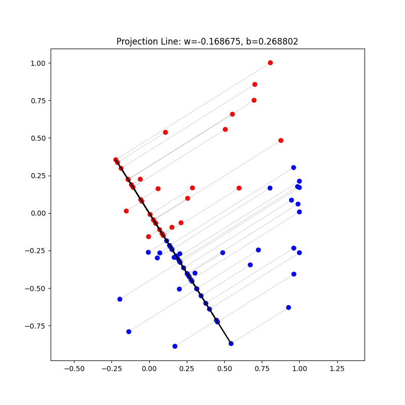

# HW2

Implement **linear classification** methods by only using numpy.

1. Move to this folder.
    
    ```bash
    cd Homework/HW2/code
    ```
    
2. Train the Logistic Regression with Gradient Descent and Cross-Entropy.
    
    ```python
    LR = LogisticRegression(
        learning_rate=1e-2,  # You can modify the parameters as you want
        num_iterations=10000,  # You can modify the parameters as you want
    )
    LR.fit(x_train, y_train)
    ```
    
3. Train the Fisher’s Linear Discriminant (FLD)
    
    ```python
    FLD_ = FLD()
    FLD_.fit(x_train, y_train)
    ```
    
4. Train and test model
    
    ```bash
    python main.py
    ```
    
5. Plot FLD projection figure
    
    
    
6. Lint the code
    
    ```bash
    flake8 main.py
    ```
    
7. Test the code
    
    ```bash
    pytest ./test_main.py -s
    ```