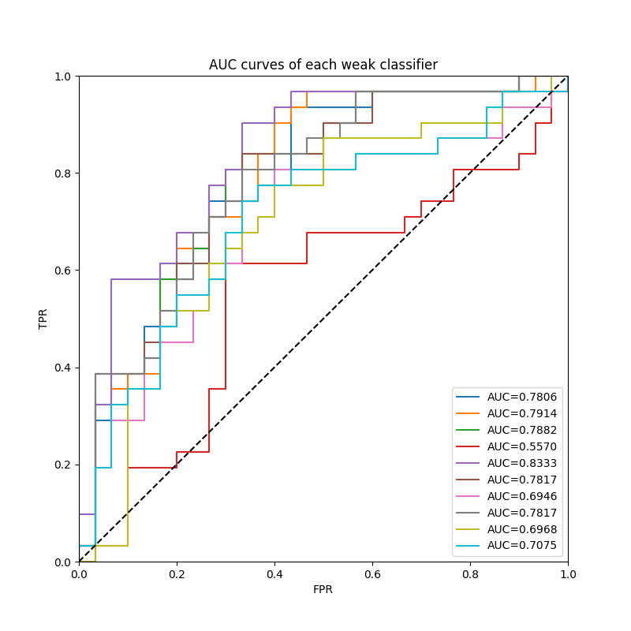
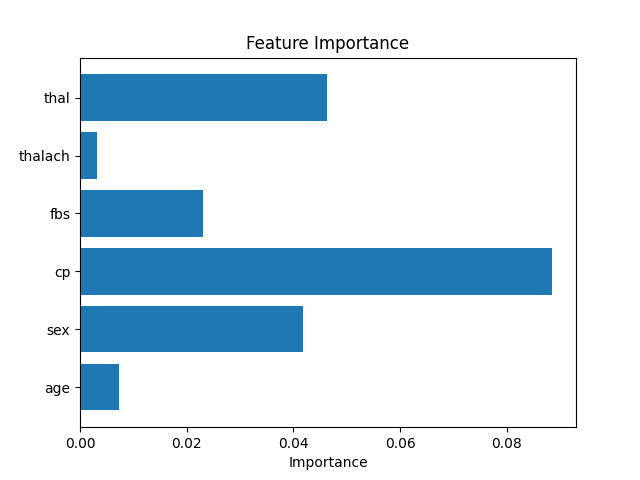
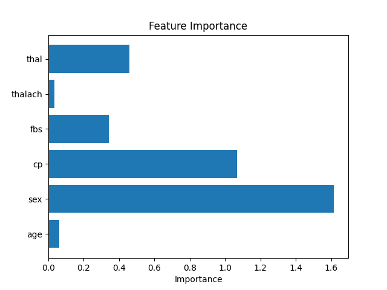

# HW3

Implement **ensemble methods** with Numpy and PyTorch.

# Usage

1. Move to this folder
    
    ```bash
    cd Homework/HW3/code
    ```
    
2. Train and test model
    
    ```bash
    python main.py
    ```
    
3. Lint the code
    
    ```bash
    flake8 main.py
    ```
    

# AdaBoost

1. Define the AdaBoost Classifier
    
    ```python
    clf_adaboost = AdaBoostClassifier(input_dim=X_train.shape[1])
    _ = clf_adaboost.fit(X_train, y_train, num_epochs=1000, learning_rate=0.001)
    ```
    
2. Plot the AUC curves of AdaBoost
   
   

3. Plot the feature importance of AdaBoost
   
   

# Bagging

1. Define the Bagging Classifier
    
    ```python
    clf_bagging = BaggingClassifier(input_dim=X_train.shape[1])
    _ = clf_bagging.fit(X_train, y_train, num_epochs=1000, learning_rate=0.004)
    ```
    
2. Plot the AUC curves of Bagging
      
   

3. Plot the feature importance of Bagging
      
   


# Decision Tree

1. Define the Decision Tree
    
    ```python
    clf_bagging = BaggingClassifier(input_dim=X_train.shape[1])
    _ = clf_bagging.fit(X_train, y_train, num_epochs=1000, learning_rate=0.004)
    ```
    
2. Plot the feature importance of Decision Tree
         
   
